北京工业大学

2025\-2026学年第二学期课设报告

__课程名称：__        移动软件开发          

__专    业：__     软件工程（实验班）       

__组    别：       TEAM__17       __          __

__项目组组长：__

学号： 24080218   姓名：    李金航  

__项目组成员：__

学号： 24080217   姓名：    李承岩   

学号： 24080212   姓名：    邢思琦  

__指导教师：     __贺国平__   __ 王岚     __       __

目    录

[1．绪论	3](#_Toc235175899)

[1\.1 系统的主要内容	3](#_Toc235175900)

[1\.2 系统涉及的技术知识点	3](#_Toc235175901)

[2．系统的需求分析	5](#_Toc235175902)

[2\.1 用户角色与业务需求	5](#_Toc235175903)

[2\.2 功能需求	5](#_Toc235175904)

[2\.3 非功能需求	5](#_Toc235175905)

[3．系统设计与实现	7](#_Toc235175906)

[3\.1 总体架构	7](#_Toc235175907)

[3\.2 界面设计	8](#_Toc235175908)

[3\.3 后端与数据设计	26](#_Toc235175909)

[3\.4 核心业务流程	27](#_Toc235175910)

[4．系统测试	28](#_Toc235175911)

[4\.1 测试环境	28](#_Toc235175912)

[4\.2 功能测试	28](#_Toc235175913)

[4\.3 测试结果与分析	29](#_Toc235175914)

[5．总结	30](#_Toc235175915)

[姓名：李金航    学号：24080218	30](#_Toc235175916)

[姓名：李承岩    学号：24080217	30](#_Toc235175917)

[姓名：邢思琦    学号：24080212	31](#_Toc235175918)

__1．绪论__

__1\.1 系统的主要内容__

白泽是一款面向企业内部知识查询与流程协作的鸿蒙移动应用。系统将知识库、智能助手、流程办理、审批待办、消息通知、考勤、内部邮件、组织关系和员工协作等能力集中到同一个移动入口中，使用户能够在移动端完成“查制度—问助手—填表单—发起流程—跟踪结果”的连续操作。

软件名称“白泽”来源于中国传统文化中的神兽。传统叙事中，白泽能够辨识万物、通晓知识并为人们提供趋吉避凶的指导。项目组受到鸿蒙、盘古等具有中国文化意蕴的命名启发，选择“白泽”作为软件名称，既体现本土文化表达，也对应系统的知识理解、制度问答、流程推荐和风险提示特征。

__1\.1\.1 系统定位与用户角色__

系统面向企业员工、审批人、系统管理员和知识管理员四类用户。普通员工主要使用知识查询、智能问答、流程申请、考勤和邮件功能；审批人处理流程待办并查看关联制度；系统管理员负责系统级治理和组织信息；知识管理员维护知识内容并处理纠错建议。不同角色登录后看到的工作台入口和待办数据不同。

__1\.1\.2 主要功能__

系统主要功能包括：基于角色的登录与权限展示；工作台待办、消息和快捷入口；知识分类、文章详情、收藏和纠错；支持文字和图片输入的智能助手；请假、报销、采购、权限等流程模板；流程提交、审批、驳回和进度跟踪；消息通知、考勤签到签退、内部邮件；组织架构、人员目录与员工协作。智能助手在识别用户意图后，不仅返回制度摘要，还能推荐相关流程，并根据问答内容生成表单草稿，用户点击“智能预填”即可进入已填充的流程表单。

__1\.2 系统涉及的技术知识点__

前端采用 HarmonyOS、ArkTS 和 ArkUI 开发，使用组件化页面组织工作台、知识库、助手、流程、消息、邮件、组织和协作等模块；通过 Repository 接口隔离页面与数据源，便于从本地 Mock 数据切换到 HTTP 后端。后端采用 NestJS、TypeScript、Prisma 和 SQLite，按模块划分认证、知识、流程、通知、考勤、邮件、助手、组织和协作服务，并通过统一响应结构和 Token 鉴权提供接口。

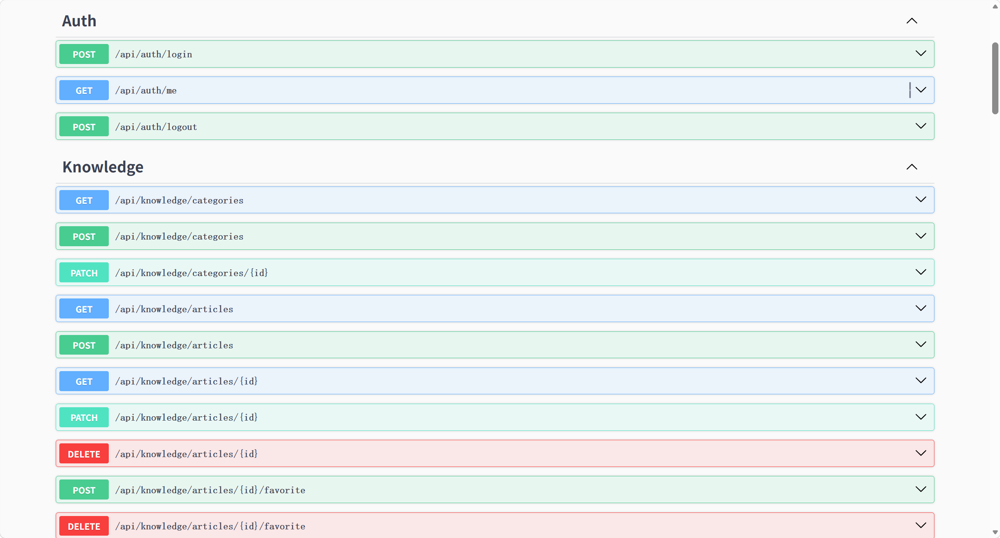图1\.1 白泽后端接口模块总览

图示说明：该页面是后端 Swagger 接口总览，用于展示认证、知识库等模块的 REST 接口，便于开发人员检查前后端接口路径和模块划分。

系统还涉及移动端状态管理、表单校验、图片读取与 Base64 传输、REST 接口调用、关系数据建模、权限控制、通知生成和自动化测试等知识点。

__2．系统的需求分析__

__2\.1 用户角色与业务需求__

企业内部办事通常需要先查找制度，再确认材料和审批人，最后在多个系统之间重复填写信息。白泽的需求是将知识和流程建立关联，降低制度查找和表单填写成本。系统需要识别当前用户角色，展示与角色匹配的工作台内容，并保证流程状态、审批意见和通知记录能够被持续追踪。

表2\.1 用户角色与业务需求

__角色__

__核心需求__

__典型操作__

普通员工

查询制度、申请流程、查看个人事项

知识检索、智能问答、签到、发起报销

审批人

处理本人待办并给出审批意见

查看流程详情、通过或驳回

系统管理员

查看系统治理信息和组织数据

处理系统级事项、查看组织关系

知识管理员

维护和改进知识内容

查看知识、接收纠错建议

__2\.2 功能需求__

功能需求可归纳为五类：第一，身份与权限需求，支持账号密码登录、当前用户信息查询和退出登录；第二，知识服务需求，支持分类浏览、详情阅读、收藏、标记有用和纠错；第三，智能服务需求，支持自然语言提问、图片识别、相关知识推荐和流程推荐；第四，流程协作需求，支持模板选择、表单填写、提交、审批、驳回和状态查询；第五，办公协同需求，支持通知、考勤、邮件、组织关系、会议、任务和群组消息。

__2\.3 非功能需求__

系统应满足易用性、可靠性、可扩展性和安全性要求。移动端页面需要适配手机屏幕，主要操作应有明确反馈；接口失败时应给出可理解的提示；前后端通过 Repository 和模块化 Service 解耦，便于替换数据源和继续扩展；登录态通过 Token 传递，敏感用户信息不在人员目录接口中返回；关键流程操作由后端统一判断并产生通知或审批记录。

__3．系统设计与实现__

__3\.1 总体架构__

白泽采用“鸿蒙移动端 \+ REST 后端 \+ SQLite 数据库”的分层结构。移动端页面负责交互和状态呈现，UseCase 层负责组织业务动作，Repository 层提供统一数据接口，HTTP Adapter 将接口调用映射到后端 REST 路径。后端由 NestJS 模块、Controller、Service、Prisma 数据访问组成，统一返回 code、message 和 data 字段。

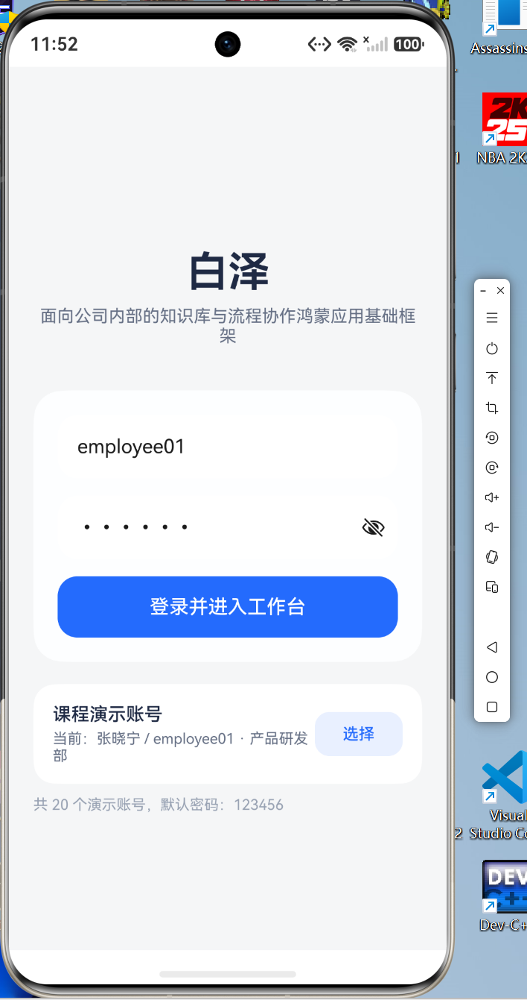图3\.1 白泽登录与角色入口

图示说明：该页面展示白泽的登录入口。用户输入账号和密码后进入系统，登录结果会决定工作台中的角色信息、待办事项和可用功能。

__3\.2 界面设计__

__3\.2\.1 工作台与知识库__

工作台以当前用户身份、部门、待办数量和快捷入口为核心，帮助用户快速进入知识、助手、流程和消息页面。知识库采用分类标签与文章卡片组合，详情页展示摘要、正文、标签、版本、更新时间、收藏和关联流程，形成从制度阅读到流程办理的入口。

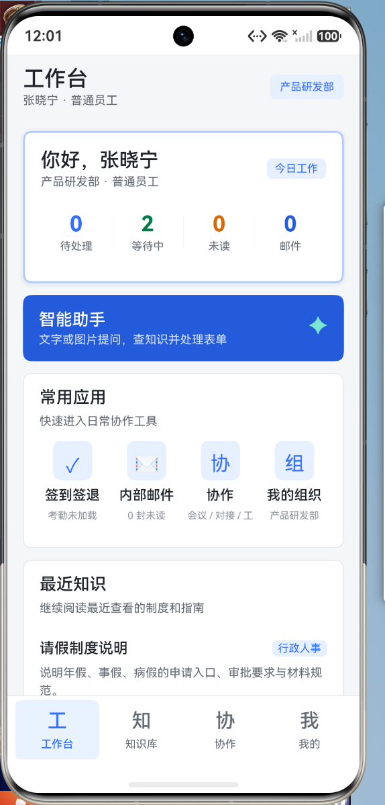图3\.2 工作台首页

图示说明：该页面是普通员工工作台，顶部展示当前用户和部门信息，中部集中显示待办、消息和快捷操作，底部导航用于切换工作台、知识、协作和个人中心。

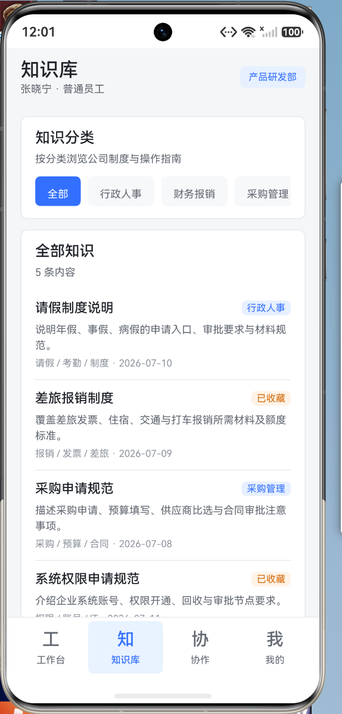图3\.3 知识库文章列表

图示说明：该页面展示知识库文章列表。用户可以按分类浏览制度文章，卡片中显示文章标题、摘要、更新时间和关联信息，便于快速定位需要的制度。

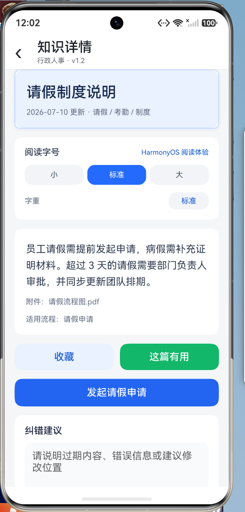图3\.4 知识详情与关联流程

图示说明：该页面展示知识文章详情，包含制度正文、标签、版本和更新时间，并提供收藏、纠错以及进入关联流程的操作，形成知识阅读到业务办理的入口。

__3\.2\.2 智能助手与自动填表__

智能助手页面支持文字输入和从相册选择图片。后端助手服务根据问题或识别出的文字匹配知识与流程，返回回答、关联知识、推荐流程、缺失字段以及表单草稿。对于请假、报销、采购和权限等问题，用户可以先阅读回答，再点击“打开表单”或“智能预填”。自动填表并不是简单跳转，而是将助手识别出的标题、日期、金额、事由和附件等字段写入流程表单，用户补充缺失信息后即可提交。

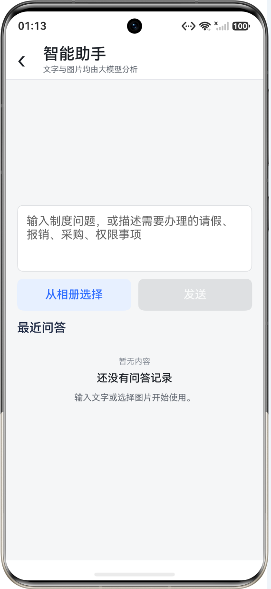图3\.5 智能助手初始界面

图示说明：该页面是智能助手的初始状态，用户可以输入制度问题，也可以从相册选择图片。页面下方保留最近问答区域，便于继续查看历史结果。

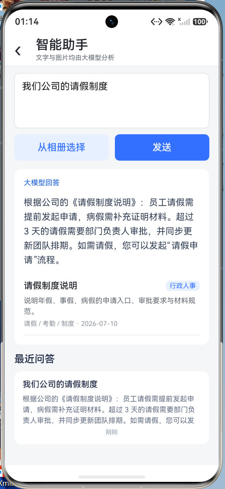图3\.6 智能助手文字问答结果

图示说明：该页面展示文字问答结果。回答区域给出制度摘要，并列出相关知识和推荐流程，用户可以继续打开知识详情或进入流程表单。

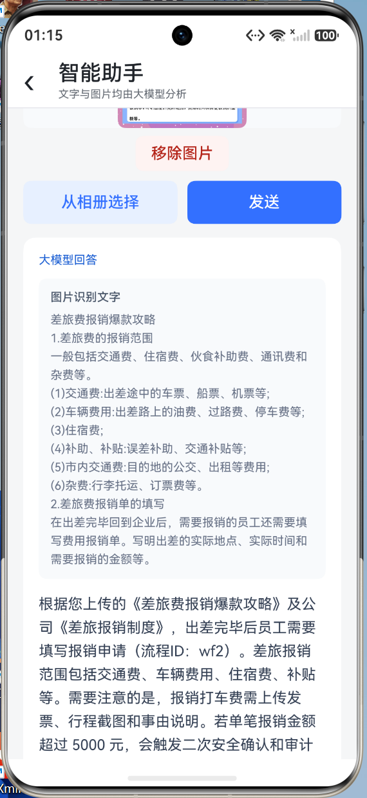图3\.7 智能助手图片识别与制度回答

图示说明：该页面展示图片输入后的处理结果。系统先呈现图片识别出的文字，再结合识别内容返回制度解释，使用户可以通过票据、截图等材料进行查询。

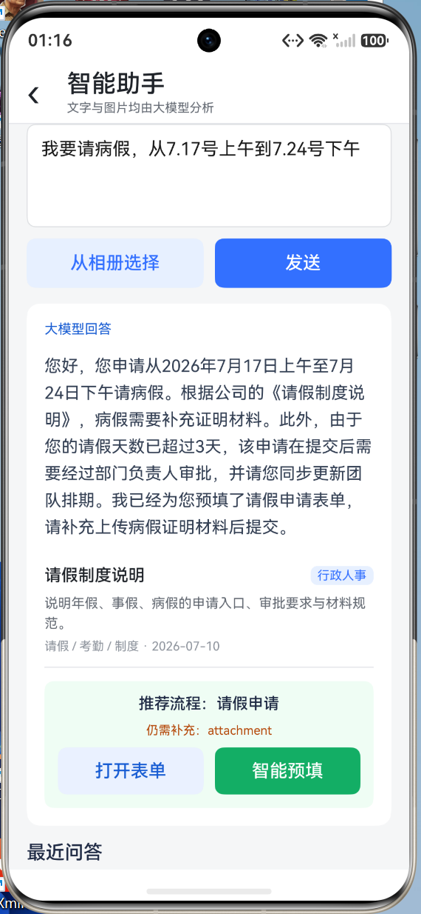图3\.8 智能助手推荐流程与智能预填

图示说明：该页面体现白泽的智能填表功能。助手根据问题识别出适合的业务流程，并提供“打开表单”和“智能预填”两个入口；点击智能预填后，问答中抽取的字段会带入后续流程表单。

__3\.2\.3 流程、消息与协作__

流程模块以模板列表和实例详情为主。员工选择模板后填写通用表单，系统根据模板生成流程实例并返回当前节点；审批人从待办列表进入详情，完成通过或驳回。消息模块集中展示流程通知，考勤模块记录签到签退和近期记录，邮件模块提供收件箱和写邮件页面，组织与协作模块则补充人员关系、会议、任务和群组消息。

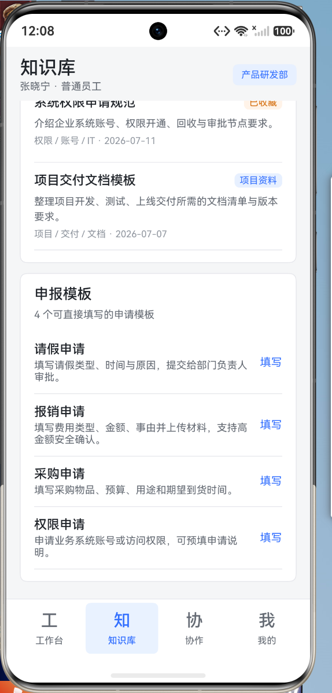图3\.9 流程模板与我的流程

图示说明：该页面展示流程模板和用户已发起的流程。模板卡片说明请假、报销、采购和权限等业务的办理方向，用户可以从这里选择要办理的事项。

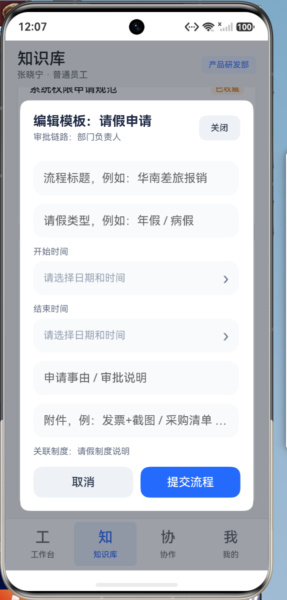图3\.10 流程申请表单

图示说明：该页面展示流程申请表单。用户填写日期、金额、事由和附件等字段后提交，页面同时保留取消和提交按钮，避免误操作。

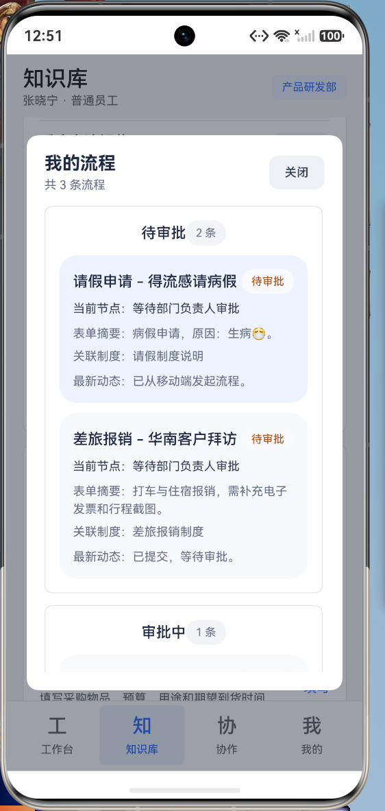图3\.11 审批人待办列表

图示说明：该页面展示审批人的待办流程。审批人可以看到申请类型、申请人、金额和当前状态，并从待办卡片进入流程详情。

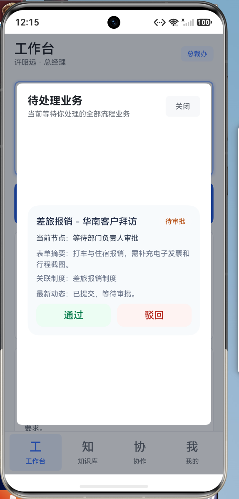图3\.12 流程审批操作

图示说明：该页面展示流程审批操作区。审批人可以查看申请材料和流程节点，并选择通过或驳回，同时填写审批意见，处理结果会写入流程记录并触发通知。

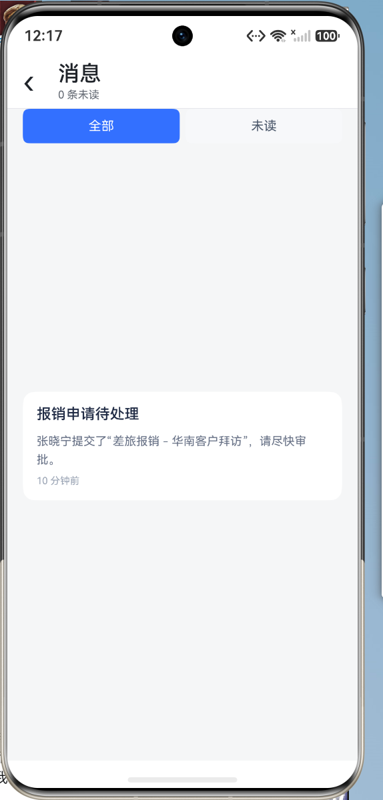图3\.13 消息通知页面

图示说明：该页面是消息中心，按已读和未读状态集中展示流程通知。用户可以通过消息了解待审批事项和流程状态变化。

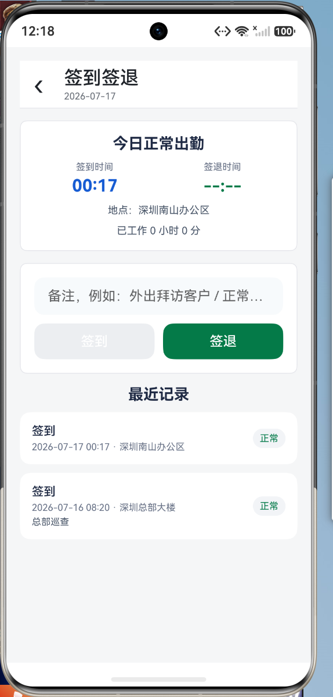图3\.14 考勤签到页面

图示说明：该页面展示考勤签到功能，包括今日签到状态、时间、地点和备注输入框；下方的近期记录用于核对历史签到签退情况。

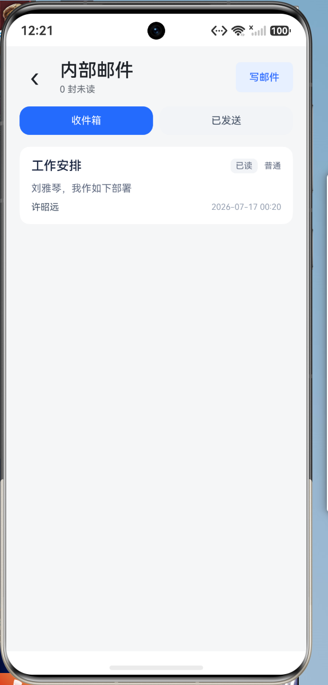图3\.15 内部邮件收件箱

图示说明：该页面展示内部邮件收件箱。邮件卡片显示发件人、主题、摘要和时间，用户可以切换收件箱与已发邮件并进入邮件详情。

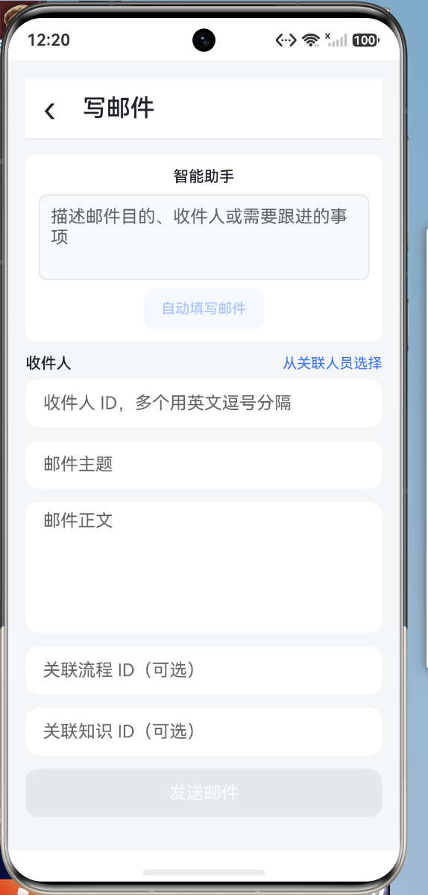图3\.16 写邮件页面

图示说明：该页面展示写邮件表单，包含收件人、主题、正文以及关联流程和知识的字段，支持从智能助手生成的邮件草稿继续编辑。

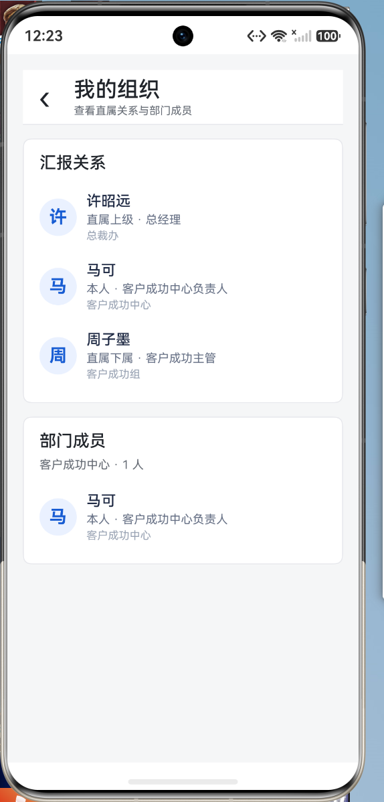图3\.17 我的组织页面

图示说明：该页面展示当前用户的组织关系，包括所属部门、直属上级、直接下属和部门成员，帮助用户确认协作对象和汇报关系。

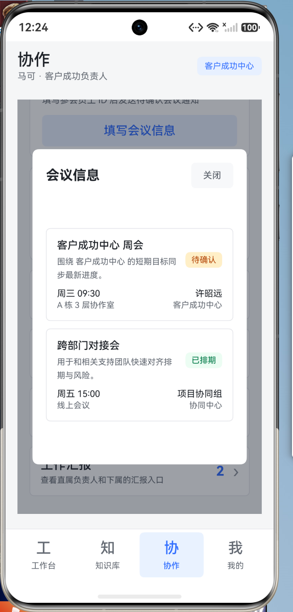图3\.18 员工协作工作对象

图示说明：该页面展示员工协作中的工作对象列表，包含任务、会议或其他协作事项的摘要、状态和参与人，用户可以进入具体对象查看详情。

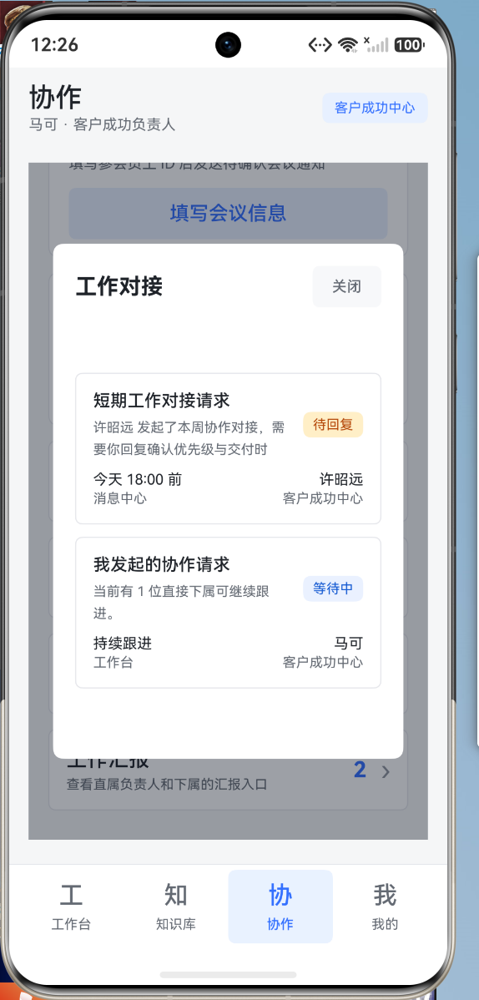图3\.19 员工协作会议与任务

图示说明：该页面进一步展示协作对象的详情卡片，例如会议安排、任务内容、截止时间和处理状态，支持员工围绕具体事项开展协作。

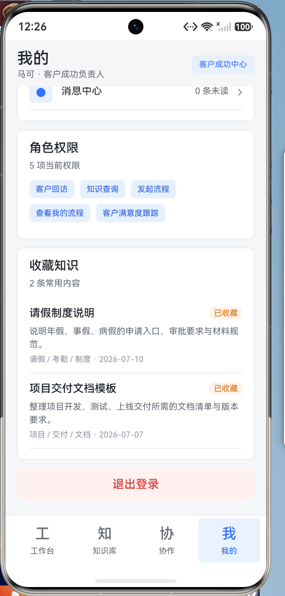图3\.20 个人中心与角色权限

图示说明：该页面是个人中心，展示用户资料、角色权限、收藏知识和其他个人信息入口，使用户能够了解当前账号可以使用的系统能力。

__3\.3 后端与数据设计__

后端以 User、Session、KnowledgeArticle、KnowledgeCategory、WorkflowTemplate、WorkflowInstance、ApprovalRecord、Notification、AttendanceRecord、InternalMail、KnowledgeCorrection、AssistantHistory 和协作相关实体作为核心数据模型。认证模块负责登录和会话；知识模块负责文章及收藏、纠错；流程模块负责模板、实例和审批记录；通知模块负责向目标角色或用户生成消息；助手模块保存问答历史并返回结构化表单草稿。SQLite 适合课程设计的本地演示，Prisma 负责模型映射和迁移管理。

表3\.1 核心模块与数据设计

__模块__

__主要实体/接口__

__前端用途__

认证

User、Session；/auth/login

登录、角色展示、退出

知识库

KnowledgeCategory、KnowledgeArticle

分类、详情、收藏、纠错

流程

WorkflowTemplate、WorkflowInstance、ApprovalRecord

申请、审批、进度跟踪

助手

AssistantHistory；/assistant/analyze

问答、图片分析、智能预填

办公协同

Notification、AttendanceRecord、InternalMail

通知、考勤、邮件

__3\.4 核心业务流程__

以报销问题为例，用户在助手中输入“报销打车费需要什么材料”，前端将问题发送到助手接口；后端根据关键词和知识文章返回制度摘要、关联知识和报销流程模板；前端展示回答并生成表单草稿；用户点击“智能预填”进入报销表单，确认金额、事由和附件后提交；流程模块创建实例并通知审批人；审批人处理待办后，员工在工作台和消息中心查看结果。该流程体现了白泽从知识理解到业务执行的闭环。

__4．系统测试__

__4\.1 测试环境__

测试采用 HarmonyOS 模拟器运行移动端，前端使用 DevEco Studio 构建；后端运行在 Node\.js 环境，服务采用 NestJS，默认通过 26102 端口提供 /api 接口。数据层使用 SQLite，初始数据包含演示账号、知识文章、流程模板、通知、邮件和协作数据。测试重点覆盖用户界面可达性、核心业务流程和接口数据映射。

__4\.2 功能测试__

表4\.1 白泽核心功能测试

__编号__

__测试场景__

__预期结果__

__结果__

T01

使用演示账号登录

进入对应角色工作台并显示用户信息

通过

T02

浏览知识列表并打开详情

显示分类、摘要、正文、标签和关联流程

通过

T03

输入制度问题进行问答

返回回答、相关知识和推荐流程

通过

T04

点击智能预填

生成带有助手草稿内容的流程表单

通过

T05

填写并提交流程

创建流程实例并进入待审批状态

通过

T06

审批人处理待办

流程状态和审批记录更新

通过

T07

查看消息、考勤和邮件

对应列表和状态正常显示

通过

T08

查看组织与协作页面

显示部门关系、成员、会议或任务

通过

__4\.3 测试结果与分析__

测试结果表明，白泽的主要用户路径能够正常完成：用户可以登录并进入角色工作台，能够从知识库查看制度，也能够通过智能助手获得制度回答并推荐流程；智能预填可以把问答结果传递到流程表单，减少重复输入；流程、通知、考勤、邮件、组织和协作模块能够在移动端打开并展示对应数据。

测试中需要关注的边界包括：图片识别结果受图片清晰度影响；助手无法匹配的问题会返回通用提示；表单缺失字段需要用户补充；后端接口需要保持 Token 有效并保证前端配置的服务地址可访问。后续可以增加更细粒度的表单校验、接口异常重试和自动化测试覆盖率。

__5．总结__

本项目围绕鸿蒙移动软件开发完成了企业知识与流程协作应用“白泽”的设计与实现。系统以知识库和流程办理为基础，将智能问答、图片识别、流程推荐、自动填表、审批待办、消息通知、考勤、内部邮件、组织关系和员工协作整合到同一个移动端入口中，形成了从知识查询到业务办理的完整闭环。课程设计使项目组系统实践了 ArkTS、ArkUI、组件化开发、状态管理、REST 接口、NestJS、Prisma 和 SQLite 等技术，也锻炼了需求分析、模块划分、前后端联调、问题排查和团队协作能力。当前版本仍有进一步完善的空间，后续可继续优化智能识别准确率、协作实时性、异常处理和自动化测试，并逐步补充更完整的管理功能。

__姓名：李金航    学号：24080218__

通过本次课程设计，我对 HarmonyOS 应用从需求分析、页面设计到功能落地的完整过程有了更加系统的认识。在开发白泽的过程中，我重点体会了 ArkTS 和 ArkUI 的组件化思路，以及页面状态、业务用例和数据仓库之间的分层关系。智能助手、知识库和流程表单的联动让我认识到，移动应用不能只关注界面展示，还需要把用户意图、数据结构和后端业务规则连接起来。开发过程中遇到的页面适配、接口字段映射和状态同步问题，也提高了我定位问题和持续调试的能力。今后我会进一步加强工程结构、自动化测试和交互细节方面的学习，使应用在可维护性和用户体验上更加完善。

__姓名：李承岩    学号：24080217__

本次课程设计使我进一步理解了前后端协同开发和数据持久化在移动软件中的重要作用。围绕白泽的登录、知识、流程、通知、考勤、邮件和协作等业务，我学习了如何使用 NestJS 划分功能模块，如何通过 Controller、Service 和 Repository 组织业务逻辑，以及如何借助 Prisma 和 SQLite 建立用户、知识文章、流程实例和审批记录等数据关系。在接口联调过程中，我认识到统一响应格式、Token 鉴权、字段约定和异常提示会直接影响移动端的稳定性。通过反复构建和调试，我提高了分析接口问题、检查数据流和完善业务闭环的能力，也更加重视代码规范和模块边界。

__姓名：邢思琦    学号：24080212__

参与白泽项目的设计与测试，使我对移动软件的需求梳理、功能验证和团队协作有了更深入的体会。项目包含多个角色和业务场景，需要从普通员工、审批人、系统管理员和知识管理员的角度检查页面入口、操作流程和结果反馈是否清晰。在整理知识查询、智能问答、自动填表、流程审批、消息、考勤、邮件和协作等功能时，我进一步理解了测试用例应覆盖正常路径、缺失输入、权限差异和接口异常等情况。课程设计也让我认识到，良好的软件不仅要能够运行，还要具备一致的界面、明确的提示和可追踪的操作结果。今后我会继续提高需求分析、测试设计和文档表达能力。

